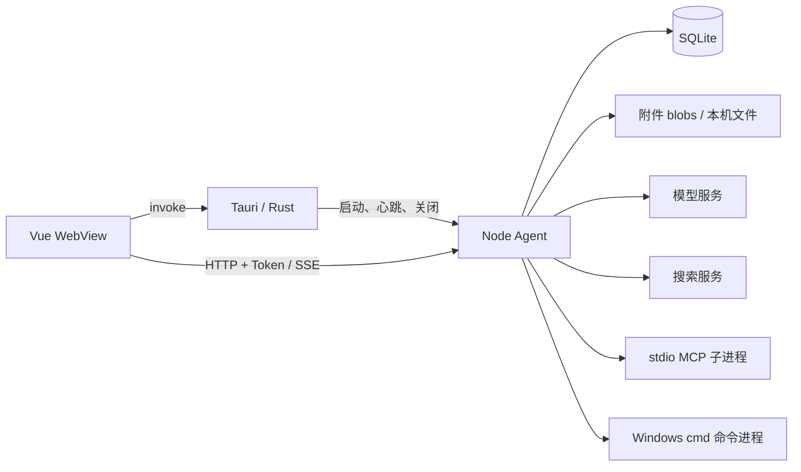

# 架构说明

## 1. 系统边界

Actl 是 Windows 本地桌面 Agent 软件，核心运行逻辑位于 `agent/`。桌面壳负责启动和回收服务，前端通过本地 HTTP 操作业务。

| 层       | 技术与入口                                                    | 职责                                                |
| -------- | ------------------------------------------------------------- | --------------------------------------------------- |
| 前端     | Vue 3、Pinia、Vue Router；[src/main.ts](../src/main.ts)       | 会话导航、输入编辑、流式输出、审批和设置            |
| 桌面壳   | Tauri 2、Rust；[lib.rs](../src-tauri/src/lib.rs)              | Agent 进程、连接令牌、心跳、目录选择与系统通知      |
| Agent    | Node.js、Express、TypeScript；[main.ts](../agent/src/main.ts) | API、模型循环、工具/权限、Skills、MCP、搜索、持久化 |
| 外部系统 | 模型服务、搜索服务、stdio MCP Server、本机命令                | 推理、网络信息和宿主环境执行能力                    |



`src/agent/` 是前端功能域，`agent/src/` 才是后端 Agent。当前客户端只接入 `local`，没有云端服务、多用户登录或远程运行时切换。数据保留 `ownerId`，但本地鉴权统一设置为 `developer:local`。

## 2. 仓库布局

```text
src/
  agent/           对话、项目、设置、Skills/MCP 的前端功能域
  services/        Tauri bridge
  stores/          本地服务 URL/token
  i18n/            中文、英文及语言选择
  composables/     主题、通知、图片预览
agent/
  src/app/         配置、依赖装配、桌面生命周期协议
  src/http/        路由、schema、handler、DTO、SSE 投影
  src/runtime/     状态、循环、并发、上下文、命令进程
  src/model/       能力、客户端、三种协议编码/解码
  src/tools/       注册与内置工具
  src/permissions/ 审批策略和 shell 风险分类
  src/repositories/SQLite、迁移、数据编解码
  src/stored-files/上传、去重、图片物化与清理
  src/security/    本地主密钥与凭据加密
  src/skills/      发现、解析和摘要缓存
  src/mcp/         stdio 连接、发现、调用和配置
  src/web-search/  搜索策略、供应商适配和设置
  src/observability/结构化日志与请求上下文
  src/hooks/       进程内执行扩展点
  scripts/         SEA bundle 和发布包
  test/            Node 测试
src-tauri/         Rust 壳、能力配置和打包配置
scripts/           将 Agent exe 复制为 Tauri 资源
docs/              项目文档
```

## 3. 桌面启动链路

1. `src/main.ts` 初始化主题、语言、Pinia 和路由，挂载 Vue。`runtime.isReady` 在这里表示前端初始化，不代表 Agent 已健康。
2. `AIView.vue` 经 `ensureAgentRuntimeReady()` 调用 bridge 的 `get_runtime_config`。
3. Rust `AgentManager.ensure_started()` 检查已管理的子进程；仍存活则复用 URL/token，否则读取设置并启动新进程。
4. 默认 `port=0`，壳选取空闲 loopback 端口；固定端口先检测可用性。每次新启动生成 32 字节随机值的十六进制令牌。
5. 壳传入 Agent home、端口、令牌和 20 秒心跳超时。Windows 子进程隐藏窗口，标准输入输出不接入 WebView。
6. Agent 创建日志及业务依赖，注册 Express 中间件与路由，监听端口。
7. 前端最多等待 30 秒，每 500 ms 请求 `/health`，单次健康请求超时 2 秒；健康后加载项目、会话、模型并恢复上次视图。

开发时壳默认使用 Node 运行 `agent/dist/main.js`，发布时使用资源目录 `binaries/actl_windows_agent_x64.exe`。`ACTL_AGENT_EXECUTABLE` 可覆盖 Agent 可执行文件，`ACTL_AGENT_NODE_PATH` 可覆盖开发时 Node 路径。

源码：[runtimeUsecase.ts](../src/agent/services/runtimeUsecase.ts)、[AIView.vue](../src/agent/components/layout/AIView.vue)、[lib.rs](../src-tauri/src/lib.rs)。

## 4. Agent 依赖装配

[app/dependencies.ts](../agent/src/app/dependencies.ts) 是装配根，按以下顺序创建实际实例：

1. `SqliteWorkspaceRepository` → `WorkspaceStore.initialize()`，载入项目和会话元数据。
2. `StoredFileService.initialize()`，准备目录并清理过期/孤立文件。
3. `SecretProtector.initialize()` → `ModelStore`。
4. `ProcessSupervisor`、`WorkspaceFileService`、`ToolRegistry`。
5. 注册文件系统、shell、上传文本、读图、Skill 发现、联网搜索和 MCP provider。
6. `McpServerManager.initialize()` 读取加密配置并连接启用的 Server。
7. `PromptCompiler`、`RunPermissionEngine`、`InMemoryHookEventBus` → `AgentLoop`。

HTTP handler 接收这些实例，不在每个请求中重新创建运行时。业务状态由 `WorkspaceStore` 管理，SQLite 仓库负责表、事务和数据编解码；模型驱动处理供应商请求和协议转换。

## 5. 对话的数据链路

```mermaid
sequenceDiagram
  participant UI as Vue / useAgent
  participant API as Express / Session handler
  participant Loop as AgentLoop
  participant Tool as Tools / Permission
  participant DB as WorkspaceStore / SQLite
  participant Model as Model driver
  UI->>API: POST responses（Token、输入、模型、权限）
  API->>Loop: 输入 DTO 转 Transcript，校验引用
  Loop->>DB: 预留范围，创建 Run 和快照
  Loop-->>UI: SSE response.created
  loop 多次模型与工具交互
    Loop->>Model: instructions + transcript + tools
    Model-->>Loop: 统一 ModelTurnEvent / Result
    Loop-->>UI: 文字、推理、工具参数增量
    Loop->>Tool: 参数、权限判断与执行
    Tool-->>Loop: 工具结果或待审批批次
    Loop->>DB: 保存时间线和状态
  end
  Loop-->>UI: 终态或 agent.permissions.requested
```

有三套有意区分的表示：供应商原始协议由 encoder/decoder 转换；领域层使用 `TranscriptItem/AgentRunRecord/AgentDomainEvent`；HTTP 层使用 Response DTO 和 `response.* / agent.*` 事件。

事件投影见 [stream-projector.ts](../agent/src/http/agent-responses/stream-projector.ts)，前端归并见 [useResponseReducer.ts](../src/agent/composables/useResponseReducer.ts)。HTTP 形状参考 Responses，但包含 Actl 会话、审批和工具字段，不等同于完整兼容的供应商 API。

## 6. 生命周期与恢复

Rust 每 5 秒发送认证心跳，Agent 在 20 秒未续期后请求关闭；未设置心跳变量的独立 Agent 不启用计时器。

桌面退出或重启时，壳停止心跳并发送认证关闭请求，等待约 1 秒后仍未退出则结束直接子进程。Agent 正常关闭会取消执行、处置 shell、关闭 MCP/HTTP、清理附件和关闭数据库，并设置 10 秒强制退出期限。两者等待时长不同，不能将退出理解为保证每次完整执行所有清理步骤。

重启后，会话内容首次加载时恢复：原 `in_progress` Run 变为 `failed/runtime_interrupted`，非待审批 Run 中缺失的工具结果补为错误；`waiting_permission` 及批次保留，可由审批接口继续。执行进程本身和 SSE 增量不会跨重启恢复。

## 7. 通信和访问边界

业务请求使用 `X-Actl-Agent-Token`，令牌由壳传给前端并保留于内存。`/health` 与 `/_lifecycle/status` 为公开状态接口；生命周期写接口独立验证令牌。

前端使用 `127.0.0.1` URL；但 [main.ts](../agent/src/main.ts) 当前调用 `server.listen(port)`，没有显式限制监听地址，同时使用默认 `cors()`。不能称服务实现了仅 loopback 绑定。

项目 cwd 是默认路径上下文，不是工具访问沙箱。内置工具运行于宿主进程权限下；路径检查、审批策略和 Windows 文件权限共同决定操作。工作区引用、文件树、Skill 包相对路径有各自范围检查。

细节见[工具与权限](modules/tools-permissions.md)、[桌面壳](modules/desktop.md)和[存储](modules/storage.md)。
