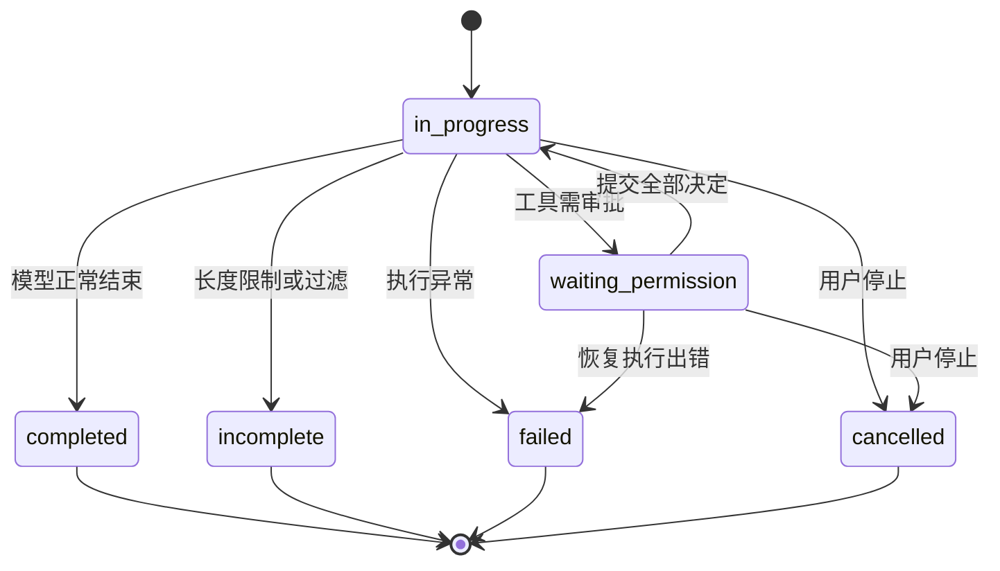

# 业务说明

## 1. 对象与规则

用户配置模型后，在独立会话或项目会话提交请求。一次请求可触发多次模型推理、文件操作、命令、搜索和 MCP 调用，直到终态或等待审批。

| 对象             | 数据与约束                                                              |
| ---------------- | ----------------------------------------------------------------------- |
| Project          | 本地目录、名称、时间戳；目录必须存在，同一 owner 下规范化目录不可重复   |
| Session          | 可选项目、标题、Run 历史、附件、滚动摘要；`projectId=null` 表示独立会话 |
| Run / Response   | 模型/权限快照、输入、时间线、待审批批次、错误和时间戳                   |
| Provider account | 地址、显示名、启用状态、账号/凭据版本；API Key 加密存储                 |
| Model target     | 本地配置 ID、供应商模型名、协议和能力；能力由用户配置                   |
| Stored file      | 文件 ID、会话归属、名称、MIME、大小、哈希；不可跨会话引用               |
| Permission batch | 当前工具批次的待决项；一次提交全部决定                                  |

源码：[workspace-store.ts](../agent/src/runtime/workspace-store.ts)、[agent-domain.ts](../agent/src/runtime/agent-domain.ts)、[catalog-types.ts](../agent/src/model/catalog-types.ts)。

## 2. 初次使用与服务设置

1. 桌面前端请求壳启动 Agent，并等待健康检查。
2. 设置中添加供应商账号：显示名、Base URL、API Key。
3. 在账号下添加模型：实际模型名、显示名、协议、工具/多模态/推理能力等。
4. 选择启用且兼容当前会话的模型，开始独立对话或选择项目目录。

运行时没有预设可用模型。前端在任意会话运行或待审批时锁定模型配置；后端通过版本快照固定已创建 Run 的参数。

服务设置支持端口和绝对存储路径。端口 0 表示自动选择；可以仅保存或保存并重启。改路径切换的是 Agent home，不会自动搬迁数据；桌面配置本身仍位于可执行文件旁 `data/agent-settings.json`。

## 3. 项目与会话

### 项目

创建项目只登记目录，不创建仓库、不复制代码、不创建 worktree。后端用 `path.resolve()` 规范化并检查目录；Windows 比较忽略大小写和末尾分隔符。

项目支持重命名、列会话、查询文件和删除。删除会删除其全部会话和关联数据，取消执行、停止会话命令并清理附件；**不会删除真实项目目录或源文件**。

### 会话和草稿

新对话可以先保存前端草稿，首次发送时再创建后端 Session。草稿按独立对话、项目草稿、具体会话分别保存在 Pinia，切换视图不串用输入。

独立会话没有项目 cwd，普通工具相对路径基于 Agent 进程 cwd。绑定项目后默认 cwd 改为项目目录。绑定仅支持 `null → projectId`，要求执行范围空闲；没有重新绑定、解绑或跨项目搬移接口。

标题可手动修改，`title=null` 清除。首次发送流程完成后前端从输入生成标题，不额外调用模型。

删除会话取消活动 Run、终止会话命令、删除数据库记录并清理文件。UI 先阻止活动会话/项目的管理操作；直接调用删除 API 时服务端仍执行取消和清理。

### 导航和搜索

上次打开的会话、项目草稿或独立草稿视图存 localStorage，并在初始化后恢复。聊天搜索在前端已加载的项目名/目录和会话标题中匹配，不检索完整消息正文。

实现：[useAgent.ts](../src/agent/composables/useAgent.ts)、[SearchChatDialog.vue](../src/agent/components/dialogs/SearchChatDialog.vue)、[project.handlers.ts](../agent/src/http/projects/project.handlers.ts)、[session.handlers.ts](../agent/src/http/sessions/session.handlers.ts)。

## 4. 发送消息

1. 检查非空输入、已选模型、历史加载和活动执行范围。
2. 必要时创建会话并迁移草稿；逐个上传附件，获取 `file_id`。
3. 将文本和引用转为结构化 content：文本、工作区路径、附件、Skill ID、MCP Server 名。
4. 创建前端临时 `local-*` Response，立即显示输入和运行状态。
5. POST responses，提交模型 ID、推理强度、权限模式和输入，fetch 读取 SSE。
6. 后端校验归属/引用、解析模型快照、检查兼容性并预留执行范围；按需压缩历史后创建 Run。
7. `response.created` 替换前端临时记录；增量事件更新文字、推理、工具和权限状态。
8. 后端到终态或待审批时结束本次流。首次发送流程结束后前端重读上下文，校准历史和状态。

工作区引用只传路径，不自动读取内容。Skill/MCP 引用是发现提示，不代表已读取完整说明或获得权限。

## 5. 状态与结果

每条输入可以调用模型多次。工具结果追加时间线后继续交给模型；单次 `continue()` 最多 100 步。工具失败通常形成 `ok:false` 结果，模型仍可处理；模型异常或循环超限使 Run 失败。

前端状态为 `idle/running/stopping/waiting_permission`，与后端六种 Run 状态区分。终态回到可发送的 idle，错误仍保留用于展示。

## 6. 权限审批

权限模式在 Run 创建时固定。UI 默认 `accept_edits`，HTTP 未传模式默认 `ask`。

| 模式           | 读取/查询 | 写入、补丁、移动 | shell 启动                      | 删除、停止命令、MCP 执行 |
| -------------- | --------- | ---------------- | ------------------------------- | ------------------------ |
| `plan`         | 允许      | 拒绝             | 拒绝                            | 拒绝                     |
| `ask`          | 允许      | 询问             | 询问                            | 询问                     |
| `accept_edits` | 允许      | 允许             | 只读/受信开发命令允许，其他询问 | 询问                     |
| `full_access`  | 允许      | 允许             | 允许                            | 允许                     |

这是审批策略，不跳过工具自身参数、授权、能力和路径检查。外部联网搜索按读取权限允许，plan 可查询；MCP 不根据 Server 自报只读免审批。

一个批次中只要有待审批项，整个批次就暂停，自动允许项也暂不执行。UI 展示动作、资源和参数，用户一次决定所有待决项。

审批校验 responseId、当前 batchId 和全部 permission_id，不接受旧批次、重复或遗漏 ID。拒绝形成错误工具结果，交给模型继续，不直接取消 Run。恢复通过新的 POST SSE 请求进行，沿用原 Run 和快照。

详见[工具与权限](modules/tools-permissions.md)。

## 7. 并发与停止

独立会话各自只有一个活动 Run；同一项目所有会话共享一个活动范围。运行和待审批都占用范围。不同项目、不同独立会话可并行。

冲突返回 `active_response_exists/project_active_response_exists`，HTTP 409 或 SSE error 可附占用会话/响应 ID，前端据此提示并定位。

停止按钮先调用取消 API，后端通过 AbortController 中止模型/工具并补齐未完成结果，返回 cancelled；前端再中断流读取。单纯断开 SSE 不自动取消 Run。已从 shell 返回的长期命令属于会话，停止回复不保证回收所有已有命令；`shell_stop`、删除会话或退出 Agent 是明确回收入口。

## 8. 附件与图片

上传归属于具体会话：单文件 25 MiB，一条 Response 最多 10 个不同文件，总大小最多 100 MiB。

| 输入                         | 模型实际使用方式                                     |
| ---------------------------- | ---------------------------------------------------- |
| JPEG/PNG/WebP/GIF 附件       | 支持对应 MIME 时发送图片数据                         |
| 新图与不支持的模型           | 兼容性校验拒绝                                       |
| 历史图与不支持的模型         | 替换文字占位，不发送像素                             |
| UTF-8 文本附件               | 先提供元数据，模型调用 `read_uploaded_file` 按需读取 |
| 其他二进制、Office、PDF 附件 | 可存储，当前上传链路不会自动解析或直接送入模型       |
| 工作区图片                   | 通过 `read_image` 读取并保存当时字节的快照           |

图片快照用于稳定历史重放。多模态能力字段存在不代表所有附件类型均已接入。

## 9. 上下文压缩

会话保存滚动摘要和累计 summarizedRunCount。新 Run 创建前，若上次输入 token 达当前模型 contextWindow 的 80%，自动压缩已有但未总结的 Run。

压缩请求不提供工具，结合旧摘要生成替换摘要；成功后记录累计覆盖数量及压缩历史。之后发送“摘要 + 未总结 Run”，原始对话仍展示。没有 usage 或 contextWindow 不自动触发，不进行本地精确 token 估算。

菜单可手动压缩，要求范围空闲。空摘要不保存；自动压缩在新 Run 创建之前，其失败可能表现为创建请求失败，而非新增失败 Run。

## 10. 扩展能力

- **Skills**：安装在 `<home>/skills/<name>/SKILL.md`。选择只传 ID，模型按需取完整说明，脚本仍通过普通 shell 执行。
- **MCP**：配置本地 stdio 命令，保存立即更新连接并加密落库。模型使用固定发现/调用入口；未接入 Resources、Prompts 或远程 HTTP Server。
- **联网搜索**：默认关闭；auto 优先支持原生搜索的 Responses 模型，否则外部搜索；native 要求模型支持；external 使用 Brave/Tavily/Serper/Bocha 独立凭据。返回 URL、摘要和引用提示。

见[Skills 与搜索](modules/skills-search.md)、[MCP](mcp.md)。

## 11. 设置和通知

设置通过 `?section=agent|appearance|prompts|search|models` 切换。外观/语言在前端保存，业务设置在 SQLite 保存。

提示词支持有序文本块、启停和 revision 并发控制。每次模型请求重新编译设置，读取项目根目录 AGENTS.md/instructions.md；不递归加载子目录指令，不自动注入完整 Skill 库。

完成/待审批可触发系统通知，主窗口聚焦时不发送。点击通知恢复并聚焦窗口，不自动切换到通知来源会话。
