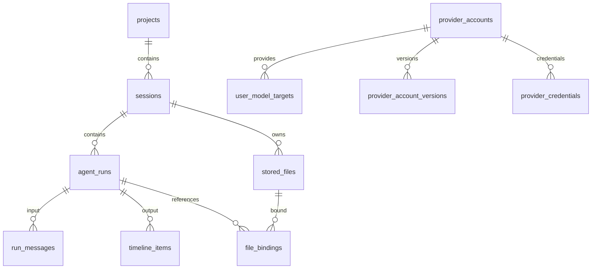

# SQLite、文件和凭据存储

## 1. 数据目录

路径由 [app/config.ts](../../agent/src/app/config.ts) 与 [app/dependencies.ts](../../agent/src/app/dependencies.ts) 决定。`<home>` 为 ACTL_AGENT_HOME，独立启动未设时用 process.cwd；桌面启动由 Rust 设置。

```text
<home>/
  database/
    development/
      workspace.db
      files/blobs/<哈希前2字符>/<接下2字符>/<完整sha256>
      files/staging/
    release/
      workspace.db
      files/blobs/...
      files/staging/
  secrets/
    development-master-key.bin
    release-master-key.bin
  logs/                    默认日志目录，可环境变量覆盖
  skills/<name>/SKILL.md    手动安装的用户技能
  .cache/skills-catalog.json
```

开发/发布数据库与主密钥分开；Skills、缓存、默认日志位于共享 home。桌面 agent-settings.json 固定在桌面 exe 旁 data，切换 home 后不会随之迁移。

## 2. 仓库层

[SqliteWorkspaceRepository](../../agent/src/repositories/sqlite-workspace-repository.ts) 使用 Node 内置 DatabaseSync，同时实现 workspace、stored file、model catalog、web search、MCP 和 prompt settings repository。账号/模型细节分到 SqliteModelCatalogStore，附件元数据分到 SqliteStoredFileStore。

数据库采用 STRICT 表、外键、WAL、synchronous=NORMAL、busy_timeout=5000。组合写入使用 BEGIN IMMEDIATE/COMMIT/ROLLBACK。API 虽常返回 Promise，SQL 操作实际同步执行，不代表后台数据库线程。

WorkspaceStore 的 mutationQueue 串行化状态修改，touch 只 upsert 变化的 timeline 项；仓库事务维持 Run、时间线、绑定等关联一致性。

## 3. 表与关系

当前 [schema.ts](../../agent/src/repositories/sqlite/schema.ts) generation 为 multi-user-multi-model，version 为 **18**。

| 表                                            | 用途                                                                 |
| --------------------------------------------- | -------------------------------------------------------------------- |
| schema_metadata                               | generation、version、创建时间                                        |
| projects / sessions                           | owner、目录、绑定和标题                                              |
| agent_runs                                    | 状态、顺序、模型/权限快照、pending batch、错误、时间戳、事件序号     |
| run_messages                                  | 每个 Run 输入消息 JSON                                               |
| timeline_items                                | 消息/推理/工具/搜索/审批 JSON，按 item_order                         |
| run_skills                                    | schema 中保留的历史结构；当前创建 Run 不单独写此表，引用在输入消息中 |
| provider_response_ids                         | 一条 Run 的多个供应商响应 ID                                         |
| session_context_states                        | 当前滚动摘要、覆盖 Run 数、最后 inputTokens                          |
| context_compressions                          | 压缩历史                                                             |
| model_invocation_usage                        | 按 runId/step 保存 token usage                                       |
| file_changes                                  | 文件变化记录能力；当前内置工具未自动调用 addFileChange               |
| stored_files                                  | 附件元数据、归属、哈希和 storage_key                                 |
| file_bindings                                 | 文件与 Run 消息/时间线项的引用关系                                   |
| provider_accounts / provider_account_versions | 账号当前元数据与历史地址/凭据版本                                    |
| provider_credentials                          | 版本化加密凭据                                                       |
| user_model_targets / user_model_preferences   | 模型目标与 owner 偏好                                                |
| web_search_settings                           | 搜索配置与加密 API Key                                               |
| prompt_settings                               | revision 和有序 blocks JSON                                          |
| mcp_servers                                   | 全部 Server 配置的加密 JSON                                          |



项目/会话删除通过外键级联清理 Run 与附件记录；真实项目文件不在此存储中，不被删除。模型快照是 JSON 记录，不依赖当前模型目标仍存在。

## 4. Schema 迁移

[migrations/index.ts](../../agent/src/repositories/sqlite/migrations/index.ts) 注册 4→18 的逐步迁移，每一步事务中升级 metadata version。新库直接创建当前 schema。不存在 metadata、generation 不同、版本高于当前或没有可用迁移链会拒绝启动；初始化 SQL 异常也可能转换成 workspace_schema_incompatible。

迁移并非全程无损：12→13 删除 agent_runs，13→14 和 14→15 重建 web_search_settings，会丢弃旧搜索设置；9→10 移除旧 memory 表。升级旧库前应保留副本，不能在文档承诺自动完整保留历史。

不兼容时程序不会自动删除目录重建。处理方式是保留/归档旧目录并选择兼容版本或新目录，具体故障操作见[开发说明](../development.md)。

## 5. 上传和内容寻址

[StoredFileService](../../agent/src/stored-files/stored-file-service.ts) 使用 Busboy 接收单个名为 file 的文件字段，不接受普通表单字段。上传先流写 staging 并计算 SHA-256，再移动到 blobs；相同内容只保留一份字节，但每次上传有独立文件元数据和会话归属。

名称会清理目录部分和 Windows 不允许字符；下载使用元数据名称，而磁盘 key 仅取哈希。单文件 25 MiB；创建 Response 时额外验证最多 10 个不同 file ID、累计 100 MiB及所属会话。

创建 Run 时记录用户附件绑定；时间线中 stored_file 也写绑定，用于工具图片快照。不能以知道 file ID 为理由跨会话下载/读取，handler 会先验证 owner/session。

## 6. 模型物化和文本读取

物化不改原始存储记录：

- JPEG/PNG/WebP/GIF 转 base64 image，历史不支持时转占位。
- 文本附件只转元数据提示和 file_id，read_uploaded_file 后再返回内容。
- 其他类型提示已存储但模型不能读取，不自动做 Office/PDF 解析。

文本可依据 text MIME、代码/文本扩展或 .env 识别；读取拒绝二进制 NUL 和非 UTF-8 编码。offset/limit 按 JavaScript 字符位置，不是文件字节或行号；默认读取 64 Ki 字符，上限 256 Ki 字符。

read_image 检查真实文件字节和图片类型，保存读取时快照为 stored_file，以便历史重放与下载；不单凭扩展名判图片。

## 7. 清理

初始化清除超过 24 小时且未绑定的上传元数据，清理数据库已不引用的 blob 和旧 staging。删除会话/项目及正常关闭也触发 orphan 清理。

blob 是否保留依据剩余 stored_files storage_key，不仅依据一条 Run；相同哈希仍被其他会话记录使用时不得删除。24 小时草稿过期是在初始化时运行，不是持续定时清扫。存储修改队列避免上传和清理相互穿插。

## 8. 凭据加密及版本删除

[SecretProtector](../../agent/src/security/secret-protector.ts) 为每个 runtime mode 创建 32 字节主密钥，以 wx 写入；AES-256-GCM 每次随机 12 字节 nonce，保存 ciphertext/authTag/keyVersion=1。

供应商 API Key、搜索 API Key 和 MCP 整份配置使用该保护器。账号/搜索 API 只返回 hasCredential；MCP 管理接口返回解密配置（包括 env），而 catalog 只返回摘要。

替换供应商凭据保留旧版本，已创建 Run 可读其快照版本；清除账号凭据删除该账号**全部凭据版本**。删除账号软删除账号记录、删除全部凭据和模型目标，保留版本元数据。清凭据/删账号后待审批 Run 即使有快照，也可能无法继续请求模型。

主密钥是本地文件，不是 Windows DPAPI 或硬件密钥服务；数据库本身、用户消息和附件字节没有整体加密。备份需要同时保留 database/files 和对应 secrets；仅复制 workspace.db 不能完整恢复附件或解密配置。

## 9. 日志

[logger.ts](../../agent/src/observability/logger.ts) 用 pino/pino-roll 输出 NDJSON，基名 actl.ndjson，按天/大小滚动。默认 info、14 配置保留值、50 MiB 文件阈值；实现按文件数量 limit 控制，并非严格按日志年龄保留 14 个自然日。

请求上下文包含 request/owner，执行日志附 session/response/model/tool 等字段。递归脱敏敏感 key、Bearer、sk- 字符串，但不能保证任意外部 stderr 文本全无秘密；MCP stderr 会截取到 2000 字符后写日志。

日志不会作为会话真实状态来源；状态以 WorkspaceStore/SQLite 为准。
